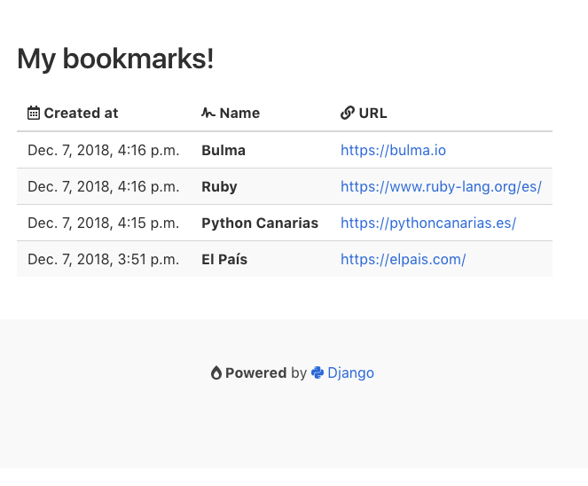

# MVP - Minimum Viable Product

A minimum viable product (MVP) is a product with just enough features to satisfy early customers, and to provide feedback for future product development.

## Usage

~~~console
$ pipenv install
$ python manage.py migrate
$ python manage.py createsuperuser
$ python manage.py runserver
~~~

## Screenshot

